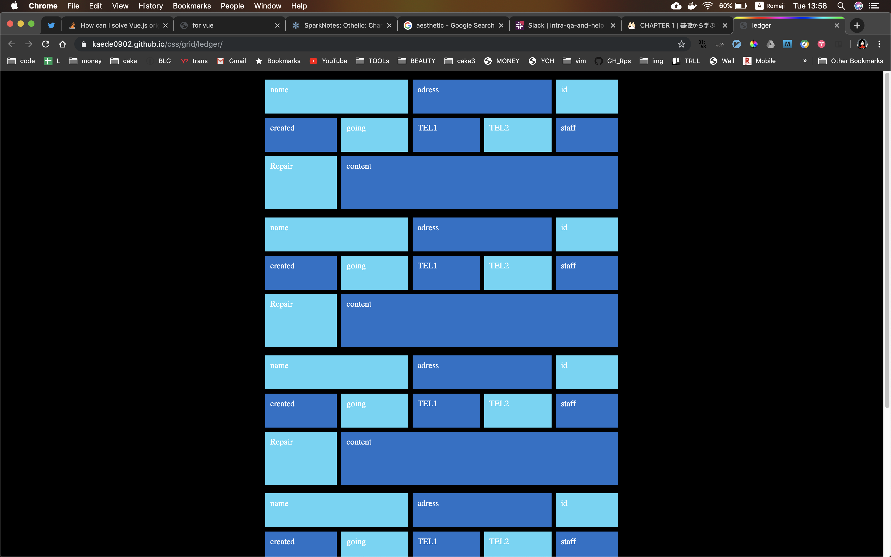

# ledger UI
* This is UI of my cakephp app.
## img


## git hub page here
https://kaede0902.github.io/css/grid/ledger

## design
### @media, width restrict
| Min | Max | width |
|:---:|:---:| :---: |
| 1611| NONE| 30%   |
| 1128| 1611| 44%   |
|  320| 1128| 90%   |

### elements
wrapper, num,
row1 (name, adress, id)
row2 (created, reserved, tel1, staff)
row3 (work_cat, content)
bottom(btn, cnt, pages)

### color
| el   | bg  | 
|:----:|:---:| 
| body | 000 | 
| wrap | 000 | 
| wrap(hov) | opc0.7 | 
| num  | 222 | 
| num(2)| 333 | 
| btn  | 444 | 

### wrapper
|width or height|size|
|:--:|:--:|
| width| 40%|
| gap |8px|
| margin width| auto|
| margin height| 40px|

### one block(NUM)
|width or height|size|
|:--:|:--:|
| height| 64px |
| width|  1fr/1fr/1fr |
| pdg | 10px|
| last height| 100px|


## todo ledger app
* pagination
* 6 work card   
111 222  
333 444  
555 666  
* finder

## for phone layout
https://gist.github.com/gokulkrishh/242e68d1ee94ad05f488
```css
@media (min-width: 1281px) {
  .wrapper {
    width: 40%
    }
}
@media (min-width: 320px) and (max-width: 480px) {
    .wrapper {
        width: 90%
    }
}
```


## grid gen
https://cssgrid-generator.netlify.com
## code pen
https://codepen.io/KAEDE0902/pen/ZEEYzQJ
