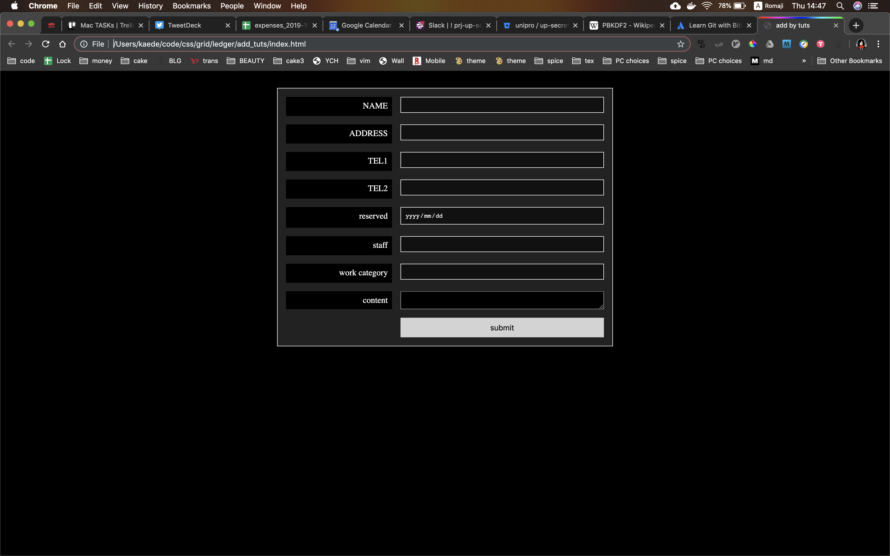

# add template by grid

* basic design

https://webdesign.tutsplus.com/tutorials/how-to-build-web-form-layouts-with-css-grid--cms-28776
## forms
name, adress, id(none), 
created, reserverd, tel, staff(select),
work_category(select), content,

* created, id is auto insert
