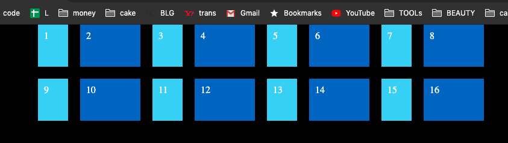
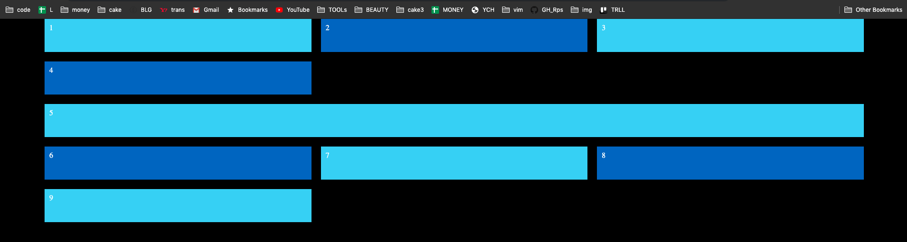
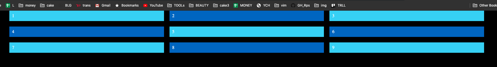
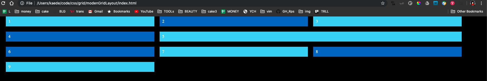
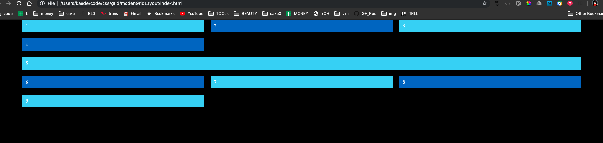

# Modern Grid Layout
https://www.youtube.com/watch?v=br-0i3U1VCA&t=681s

## Number of Columns and rows
Use these.
```css
grid-template-columns: num num num;
grid-template-rows: num num num;
```

## gap between each grid items
```css
grid-column-gap: 20px;
grid-row-gap: 20px;
// or grid-gap:20px;
```
## fr, repeat()
1fr: 100% width 1 column.  
2fr:  50% width 2 column.  
3fr:  33% width 3 column.  

* these are same.
```css
grid-template-columns: 1fr 1fr 1fr;
grid-template-columns: repeat(3,1fr);
```
### repeat pattern
* 4 times of (50px 100px)
```css
grid-template-columns: repeat(4, 50px 100px);
```

### repeat auto fill
* it floats in same interval.
```css
grid-template-columns: repeat(auto-fill, 50px);
```

## auto-rows
https://www.youtube.com/watch?v=SPFDLHNm5KQ
* define all rows height!
```css
grid-auto-rows:70px;
```


## span
* increasing this increase the one grid.  
```css
.item5 {
    grid-column: span 3;
}
```
### span 1 (default)

### span 2 

### span 3 


## minmax()


## general
* use nth-child(even) to look easier.
```css
.item:nth-child(even) {
    background: #236fc8;
}
```

## grid-lines
* see ../respCrash
