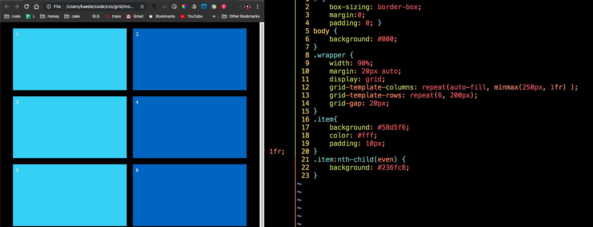

# Modern Grid Layout
https://www.youtube.com/watch?v=br-0i3U1VCA&t=681s
## what is css grid?
align direct child of the its `display: grid` 
items by grid.  
## contents
* gap
* fr
* repeat(times, numfr)
* repeat(auto-fill, minmax())
* repeat(times, width1, width2)
* auto-rows
* span
## Number of Columns and rows
Use these.
```css
grid-template-columns: num num num;
grid-template-rows: num num num;
```
## gap between each grid items
```css
grid-column-gap: 20px;
grid-row-gap: 20px;
// or grid-gap:20px;
```
## fr, repeat()
* `fr` is a fractional unit.  
* equal width columns.  
1fr: 100% width 1 column.  
2fr:  50% width 2 column.  
3fr:  33% width 3 column.  
### grid-template-columns: 
####  1fr 

#### 1fr 1fr

#### 1fr 1fr 1fr


### repeat()
* these are same.
```css
grid-template-columns: 1fr 1fr 1fr 1fr 1fr 1fr 1fr 1fr 1fr 1fr 1fr;
grid-template-columns: repeat(10,1fr);
```

### repeat(auto-fill, minmax())
* simple responsive layout element
* at least width 250px, align 1fr
```css
grid-template-columns: repeat(auto-fill, minmax(250px, 1fr) );
```




### repeat pattern
* width (50px, 100px) x 3 times.
```css
grid-template-columns: repeat(3, 50px 100px);
```

* width (100px, 30px) x 3 times.
```css
grid-template-columns: repeat(3, 100px 30px);
```


## auto-rows
https://www.youtube.com/watch?v=SPFDLHNm5KQ
* define all rows height!
```css
grid-auto-rows:70px;
```


## span
* increasing this increase the one grid.  
```css
.item5 {
    grid-column: span 3;
}
```
### span 1 (default)

### span 2 

### span 3 


## general
* use nth-child(even) to look easier.
```css
.item:nth-child(even) {
    background: #236fc8;
}
```

## grid-lines
* see ../respCrash
